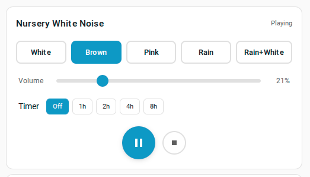

# HA White Noise Card



A custom Home Assistant Lovelace card that turns any `media_player` speaker into a white noise machine. Designed for nurseries, bedrooms, or anywhere you want ambient noise control from your HA dashboard.

## Features

- **Noise types**: White, Brown, Pink, Rain, and Rain+White combo on seamless 3-minute loops
- **Auto-looping**: Automatically replays when the track ends — plays continuously until stopped
- **Sleep timer**: Preset durations (1h, 2h, 4h, 8h) with live countdown, auto-stops when done
- **Simple controls**: Play/pause, stop, volume slider, noise type selector
- **Speaker binding**: Each card instance targets a specific `media_player` entity
- **Remembers settings**: Resumes last noise type and volume on play
- **Visual card editor**: Configure the card from the HA UI

## Music Assistant / Snapcast Compatibility

This card uses `music_assistant.play_announcement` for playback, which is required for Music Assistant-managed speakers (e.g., Snapcast clients). Standard `media_player.play_media` does not work reliably with MA players because:

- MA players reject `media-source://` URIs (500 errors)
- MA players reject direct HTTP URLs to HA's `/local/` path
- MA players expect `library://track/` URIs for normal playback, but those require tracks to be in the MA library

`play_announcement` bypasses MA's queue/library and sends audio directly to the speaker via a URL. The card constructs a full URL (`http://<ha-host>/local/white-noise/<file>.mp3`) that the speaker can fetch from HA's static file server.

**Volume and stop** still use the standard `media_player.volume_set` and `media_player.media_stop` services, which work fine with MA players.

### Tested working with

- Music Assistant + Snapcast speakers on Home Assistant OS
- Entity type: `media_player.*` managed by Music Assistant
- Audio served from `/homeassistant/www/white-noise/` via HA's `/local/` static path

### What did NOT work (for reference)

| Approach | Result |
|----------|--------|
| `media_player.play_media` with `media-source://media_source/local/...` | 500 error on MA players |
| `media_player.play_media` with `http://<ha>/local/...` | 500 error on MA players |
| `media_player.play_media` with `/local/...` relative path | Starts then immediately stops |
| `media_player.play_media` with `media_content_type: music` | 500 error |
| `media_player.play_media` with `media_content_type: audio/mpeg` | 500 error on MA players |
| Targeting Snapcast client entity directly | 500 error with media-source URIs |
| `media_player.repeat_set` with `repeat: one` | Not supported by MA announcement playback |

## Installation

### Manual

1. Copy `dist/white-noise-card.js` to `config/www/`
2. Copy all MP3 files from `audio/` to `config/www/white-noise/`
3. In HA, go to **Settings** > **Dashboards** > **Resources** and add `/local/white-noise-card.js` as a JavaScript Module
4. Restart Home Assistant
5. Add the card to your dashboard

### HACS

1. Open HACS in your Home Assistant instance
2. Go to **Frontend** > **Custom repositories**
3. Add this repository URL with category **Lovelace**
4. Install **White Noise Card**
5. Copy the audio files from `audio/` to your HA `config/www/white-noise/` directory
6. Restart Home Assistant

## Configuration

```yaml
type: custom:white-noise-card
entity: media_player.living_room_speaker
name: "White Noise"
```

### Options

| Key | Type | Required | Default | Description |
|-----|------|----------|---------|-------------|
| `entity` | string | Yes | -- | `media_player` entity ID |
| `name` | string | No | Entity friendly name | Card title |
| `default_noise` | string | No | `white` | Initial noise type (`white`, `brown`, `pink`, `rain`, `rain_combo`) |
| `default_volume` | number | No | `50` | Initial volume percentage (0-100) |

## Audio Files

| File | Description |
|------|-------------|
| `white_noise.mp3` | 3-min white noise loop |
| `brown_noise.mp3` | 3-min brown noise loop |
| `pink_noise.mp3` | 3-min pink noise loop |
| `rain.mp3` | 3-min rain sound (filtered pink noise with echo) |
| `rain_combo.mp3` | 3-min white noise + rain mix |

All generated with ffmpeg. See below to regenerate.

## Development

```bash
npm install
npm run build       # Build dist/white-noise-card.js
npm run watch       # Rebuild on changes
```

### Regenerate Audio Files

Requires `ffmpeg`:

```bash
cd audio/

# Core noise types
ffmpeg -f lavfi -i "anoisesrc=d=180:c=white:r=44100:a=0.5" -af "afade=t=in:d=0.5,afade=t=out:st=179.5:d=0.5" -b:a 192k white_noise.mp3
ffmpeg -f lavfi -i "anoisesrc=d=180:c=brown:r=44100:a=0.5" -af "afade=t=in:d=0.5,afade=t=out:st=179.5:d=0.5" -b:a 192k brown_noise.mp3
ffmpeg -f lavfi -i "anoisesrc=d=180:c=pink:r=44100:a=0.5" -af "afade=t=in:d=0.5,afade=t=out:st=179.5:d=0.5" -b:a 192k pink_noise.mp3

# Rain (filtered pink noise with echo)
ffmpeg -f lavfi -i "anoisesrc=d=180:c=pink:r=44100:a=0.4" -af "highpass=f=2000,lowpass=f=8000,aecho=0.8:0.7:40:0.3,aecho=0.6:0.5:20:0.25,volume=1.5" -b:a 192k rain.mp3

# Rain + white noise combo
ffmpeg -f lavfi -i "anoisesrc=d=180:c=white:r=44100:a=0.25" -f lavfi -i "anoisesrc=d=180:c=pink:r=44100:a=0.4" -filter_complex "[1:a]highpass=f=2000,lowpass=f=8000,aecho=0.8:0.7:40:0.3,aecho=0.6:0.5:20:0.25,volume=1.5[rain];[0:a][rain]amix=inputs=2:duration=first[out]" -map "[out]" -b:a 192k rain_combo.mp3
```

## Deployment Notes

When deploying updates to HA without a full restart, the browser may cache the old JS. Options:
- Add a cache-busting query param to the resource URL (e.g., `/local/white-noise-card.js?v=2`)
- Rename the file (e.g., `white-noise-card2.js`) and update the resource
- Either approach requires an HA restart to reload the Lovelace resource registry

## Documentation

- [PROJECT_SPEC.md](docs/PROJECT_SPEC.md) -- High-level overview and feature summary
- [DEVELOPMENT_SPEC.md](docs/DEVELOPMENT_SPEC.md) -- Detailed technical specification
- [notes/](docs/notes/) -- Voice notes and planning recordings
